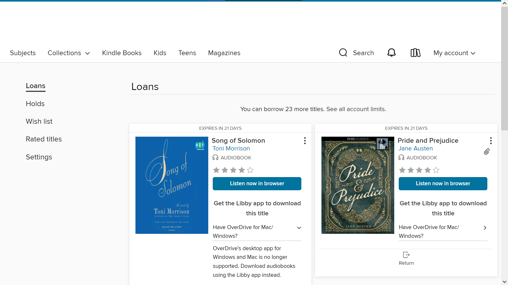
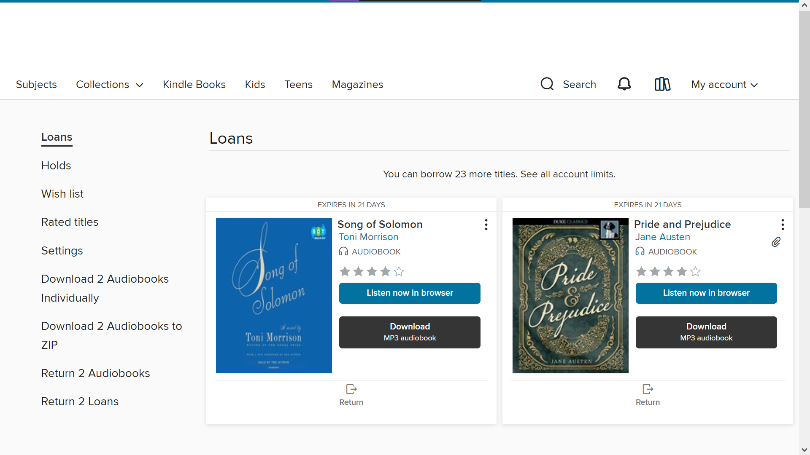

# OverDrive.Userscript

OverDrive.Userscript is a [TamperMonkey](https://www.tampermonkey.net/) userscript written in TypeScript and compiled to JavaScript. JavaScript releases of the TypeScript codebase are handled by GitHub Actions and can be found in the [releases](https://github.com/simon-techkid/OverDrive.Userscript/releases).

## Step 1: Downloading TamperMonkey

TamperMonkey is required for running OverDrive.Userscript. It is available as a browser extension for most modern browsers:

- [For Chrome](https://chrome.google.com/webstore/detail/tampermonkey/dhdgffkkebhmkfjojejmpbldmpobfkfo)
- [For Firefox](https://addons.mozilla.org/firefox/addon/tampermonkey)
- [For Edge](https://microsoftedge.microsoft.com/addons/detail/tampermonkey/iikmkjmpaadaobahmlepeloendndfphd)

## Step 2: Installing OverDrive.Userscript

After you have installed TamperMonkey, you can install the latest version of OverDrive.Userscript by simply opening the `.js` file of the release you wish to install.

- [Install the Latest Release](https://github.com/simon-techkid/OverDrive.Userscript/releases/latest/download/script.user.js)
- [Install the first updateable Release, v1.11](https://github.com/simon-techkid/OverDrive.Userscript/releases/download/v1.11/script.user.js)

TamperMonkey can get new updates for OverDrive.Userscript from GitHub over the internet, as long as you have OverDrive.Userscript v1.11 or newer installed in TamperMonkey.

## Step 3: Go to your library loan page

After the userscript is installed, go to `https://<yourlibrary>.overdrive.com/account/loans` (replacing `<yourlibrary>` with the OverDrive ID of your library).

### With & Without the Userscript

As you can see, adding the userscript adds some options to the loans page:

### Given Options

- `Download 2 Audiobooks Individually` - Downloads all audiobooks in your account, each downloading to your computer as an individual file. In our example, the user has 2 audiobooks.
- `Download 2 Audiobooks to ZIP` - Downloads all audiobooks in your account, in a single ZIP file, to your computer.
- `Return 2 Audiobooks` - Returns all audiobooks in your account to the library.
- `Return 2 Loans` - Returns all loans (both books and audiobooks) in your account to the library.

Each audiobook loan has a new `Download` button below its `Listen now in browser` button. This allows you to download individual audiobook files rather than using the mass options on the left.